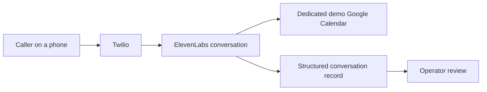

# Maya, the Harbour & Oak voice concierge

A phone receptionist that helps a caller explore a design idea, confirms the exact contact details and arranges a useful next step.

Built by **GrowthForge AI** using ElevenLabs Agents, Twilio and a dedicated Google Calendar. Harbour & Oak is a fictional kitchen and lighting studio. This is a demonstration build, not a customer deployment or an operating showroom.

[See the project on GrowthForge AI](https://growthforgeai.com/voice-concierge)

## Hear two complete conversations

- [Lighting enquiry to consultation](recordings/maya-lighting-consultation.mp3): Maya compares two concepts, confirms a corrected email and preferred callback, asks invitation permission and illustrates a successful demo booking.
- [Landline email recovery](recordings/maya-landline-recovery.mp3): Maya helps with storage, recognises an uncertain email and retains a confirmed callback request for human review.
- [Read both complete scripts](recordings/scripted-scenarios.json) or [read the recording notes and transcripts](recordings/README.md).

These are **scripted two-voice TTS simulations**, produced with Eleven v4: Lucy as Maya and Roger as the caller. They are performed scripts, not autonomous agent-to-agent tests or customer calls. Calendar and operator outcomes in the scripts are illustrative; generating or listening to these recordings creates no actual event or callback request. Their timing does not measure live-agent latency, interruptions or background-noise handling.

These are static files. Listening does not connect to the agent or consume voice-agent credits.

## What the demonstration can do

| Caller need | Behaviour |
| --- | --- |
| Explore a kitchen, lighting or storage idea | Give a relevant recommendation from a small, clearly illustrative catalogue. Stay with the caller's requested scope. |
| Correct an email address | Repair only the uncertain part, preserve punctuation and obtain fresh approval of the complete address. |
| Call from a landline | Use spoken confirmation. If two repairs still leave the email uncertain, record a preferred callback request for human verification. No SMS dependency. |
| Arrange a consultation | Agree a future 20-minute slot, obtain explicit invitation consent, check the dedicated calendar and create one demo event. |
| Ask for a person | Record an enquiry for operator review and stop booking intake. A callback request is not a connected live transfer. |
| Encounter a failed or uncertain tool result | State that the booking is unconfirmed. Do not invent success or blindly retry a timed-out creation. |

## How it is built



The agent uses native speech recognition, turn handling and a language model, with a scoped knowledge base and native calendar tools. The current configuration uses Eleven v4 Turbo, Lucy, Scribe v2 Realtime and GPT-6.1 Sol. These are configuration facts, not a claim that this repository runs those services.

[Architecture and integration boundaries](docs/architecture.md) · [Contact and booking procedure](docs/contact-and-booking.md) · [Evaluation evidence and test guide](docs/evaluation.md)

## Evidence and limits

- An earlier owner-only live test created a real 20-minute demo calendar event and returned meeting details. Email inbox receipt was not independently verified.
- A later targeted workflow evaluation passed its four configured criteria with **mocked tools**. Historical checks on previous revisions are not an acoustic assessment of the current voice.
- No customer conversion, latency, transcription-accuracy or revenue metric is claimed.

Live transfer, SMS, payments, CRM, Make, M365 and outbound qualification are not connected in this demonstration. They require a separately scoped implementation and acceptance testing. Native procedure eligibility is evaluated by the language model; it is not a deterministic server-side validation gate.

## What this repository contains

This is a **public case study**, with architecture notes, complete scripted conversations, transcripts and a test guide. It deliberately contains no executable live agent, operational prompt export, service credentials, integration exports, calendar identifiers, callable demo number or live agent share link. The operational build remains private.

To check the publication boundary locally, use Python 3:

```sh
python3 scripts/check_publication.py
```

The check scans public text and rejects credential-like data, operational identifiers, live agent destinations and unapproved media. It does not make external requests or spend API credits.

## Discuss a build for your business

[Book a conversation with GrowthForge AI](https://cal.com/growthforgeai/30min) or visit [growthforgeai.com](https://growthforgeai.com/).

Documentation and recordings are © 2026 GrowthForge AI. All rights reserved. This portfolio repository is available for viewing; it does not grant redistribution rights to the recorded voices.
